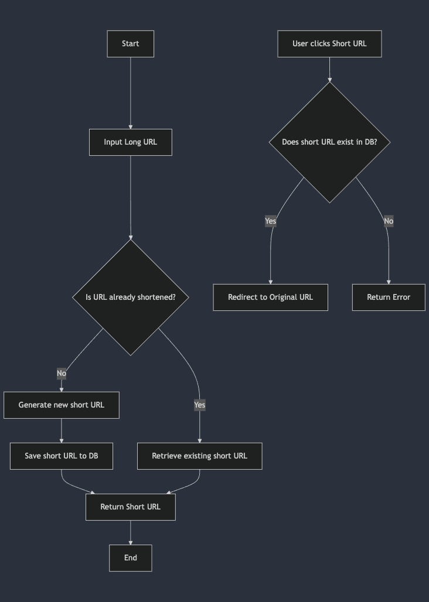

# URL shortener app in Golang

## Getting Started

### Prerequisites

- Go 1.23+
- PostgreSQL
- Docker

### Installation

- Clone the repository
  ```sh
  git clone https://github.com/yourusername/url-shortener-go.git
  cd shortly
  ```
- Install dependencies
  ```sh
  go mod download
  ```
- Configure .env file
  ```sh
  DB_CONNECTION_STRING={YOUR_DB_CONNECTION_STRING}
  ```
- Run postgres
  ```sh
  cd infra
  docker-compose up -d
  ```
- Run application

  ```sh
  go run ./cmd/api

  # if you already have installed Air then you can just run
  air
  ```

## API endpoints

- GET /health
- GET /v1/{shortUrl}
- POST /v1/url/shorten

#### Request body

```sh
  {
    "value": "http://localhost:4000"
  }
```

## Flowchart


